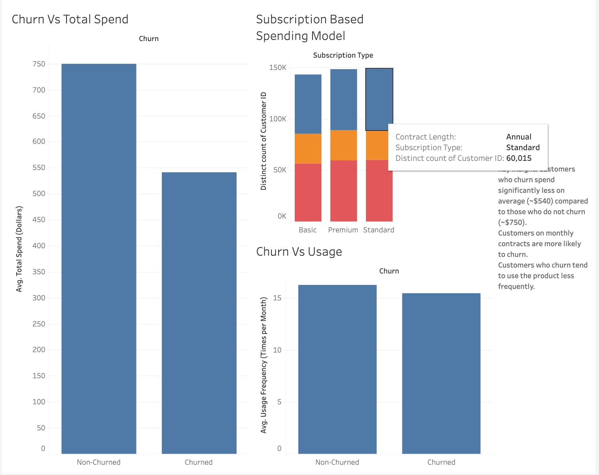

# Customer Churn Analysis Project

## 📌 Overview
This project demonstrates a full-cycle data analysis workflow to identify key drivers of customer churn.  
The process included **data cleaning with Python**, **exploratory analysis with SQL**, and the creation of an **interactive dashboard in Tableau** to communicate insights.

## 📊 Tableau Dashboard
- Download the interactive Tableau workbook: [**Churn Dashboard (.twbx)**](Churn%20Table.twbx)  
- Dashboard Screenshot:  
  

The dashboard visually highlights key findings such as churn rates by contract type, average spend differences, and usage frequency.

## 🔎 Project Workflow
1. **Data Cleaning (Python + Pandas)**  
   - Loaded the raw churn dataset into Pandas.  
   - Handled missing values, standardized column names, and removed duplicates.  
   - Exported a clean dataset for further analysis.  

2. **Data Analysis (SQL with SQLite)**  
   - Queried the cleaned dataset to uncover trends (e.g., churn by contract type, tenure, spending patterns).  
   - Used filtering, aggregation, and joins to answer specific business questions.  

3. **Visualization (Tableau)**  
   - Connected Tableau to the cleaned dataset.  
   - Built an interactive dashboard with churn vs. spend, subscription type, and usage patterns.  
   - Added key insights text to make the findings clear to stakeholders.  

4. **Version Control (Git & GitHub)**  
   - Used Git for tracking project changes.  
   - Published the project repo to GitHub as part of my analytics portfolio.  

## 🛠 Tools Used
- **Python & Pandas** → data cleaning, preprocessing, and export.  
- **SQLite (SQL)** → querying and exploratory analysis of churn patterns.  
- **Tableau** → dashboard creation and data storytelling.  
- **Git & GitHub** → project version control and portfolio hosting.  

---
